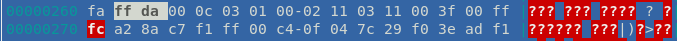
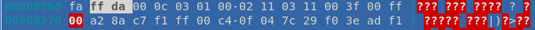
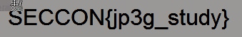

# JPEG file (Binary, 100 points)

```
JPEG file

Read this JPEG is broken.
It will be fixed if you change somewhere by 1 bit.
tktk-892009a0993d079214efa167cda2e7afc85e6b9cb38588cba9dab23eb6eb3d46
```

## Writeup

After downloading and opening the image, it looks like this:


We spent lots of time studying the JPEG file structure trying to figure out what it could possibly be. We changed bytes in many places and counted the buffer sizes. Everything seemed right.

After looking at the JPEG documentation [1], we find the following:

`"If a 0xff byte occurs in the compressed image data either a zero byte (0x00) or a marker identifier follows it. Normally the only marker that should be found once the image data is started is an EOI. When a 0xff byte is found followed by a zero byte (0x00) the zero byte must be discarded."`



As you can see in the previous image, after the data section starts, there is a `0xFFFC`.



After changing that to `0xFF00`, we find the flag:



## Tools

* [HT editor](https://github.com/sebastianbiallas/ht)

## Sources

* [1] ["JPEG File Layout and Format"](http://vip.sugovica.hu/Sardi/kepnezo/JPEG%20File%20Layout%20and%20Format.htm)
